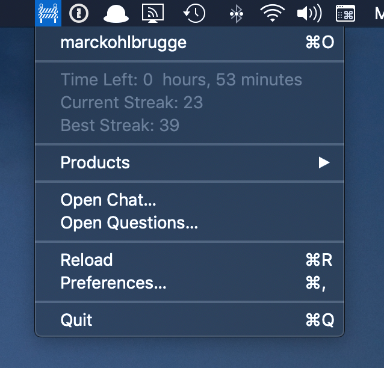
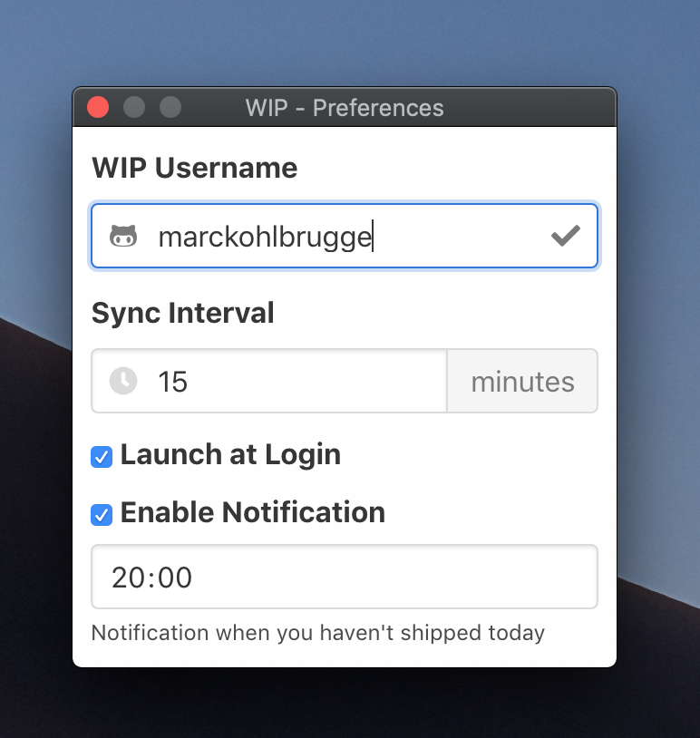

<h3 align="center">WIP</h3>

🚧 WIP menubar app

    
    
    
    

## Installation

Download the latest version of WIP from the **[GitHub releases](https://github.com/marckohlbrugge/wip-menubar/releases)** page. (macOS, Windows, and Linux)

## Features

- Quickly create a todo with a system-wide shortcut (`Ctrl+Space`)
- See your current streak & best streak
- Notification when you haven't shipped today
- See time left to keep your streak
- Launch at login
- Jump to your product pages

## Screenshots

### Menubar

### Preferences

## Menu Bar Icons

WIP's menu bar icon is updated depending on your current streak status:

|                                                              | Status  | Description                                           |
| ------------------------------------------------------------ | ------- | ----------------------------------------------------- |
|  | Done    | You've shipped today                                  |
|  | Todo    | You haven't shipped today                             |
|  | Loading | Your streak data is being requested from WIP          |
|  | Failed  | Your streak data request failed                       |

## Development

Run `yarn dist` to build apps.

## Credits

This app is almost a 1:1 copy of [streaker](https://github.com/jamieweavis/streaker) by [Jamie Weavis](https://github.com/jamieweavis). Major props to him for open sourcing his work.

## License

This project is licensed under the MIT License - see the [LICENSE.md](LICENSE.md) file for details.
